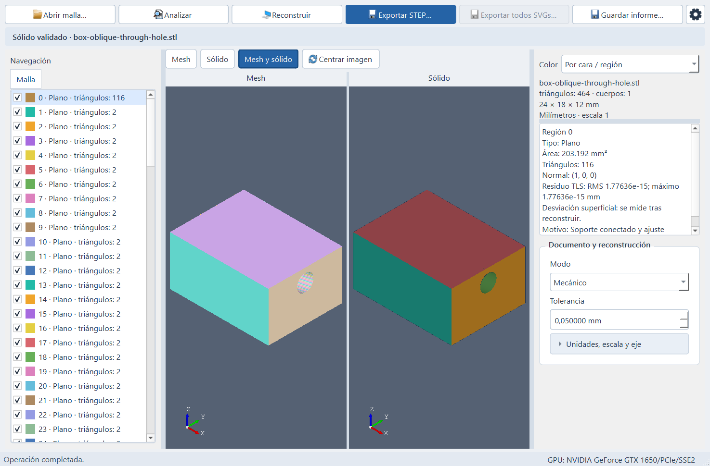
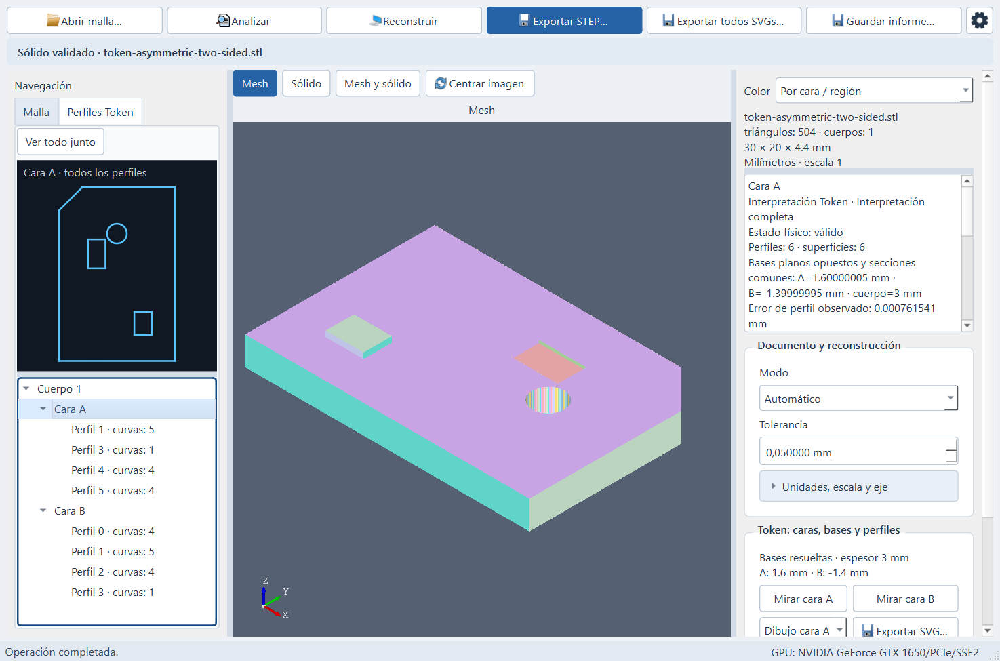

# Mesh2Solid

**Español** | [English](README.en.md)

**De una malla 3D a un sólido CAD validado, con perfiles SVG para piezas tipo Token.**

Mesh2Solid es una aplicación de escritorio que permite abrir modelos **STL, OBJ y 3MF**, analizar su geometría y reconstruir sólidos dentro de las familias de formas admitidas. Está orientada a dos usos: **tokens y piezas de espesor escalonado** con relieves, rebajes o agujeros, y **piezas mecánicas** con superficies reconocibles.

El resultado se puede exportar a **STEP** para continuar trabajando en un programa CAD. En el modo Token también se pueden obtener **perfiles SVG a escala real** y generar piezas de relleno independientes para impresión multicolor.

**[Descargar Mesh2Solid 0.1.0 para Windows x64](https://github.com/Qualith/Mesh2Solid/releases/tag/v0.1.0)** · Portable · Interfaz en español e inglés

*Ejemplo de reconstrucción mecánica: malla original a la izquierda y sólido validado a la derecha. Las cámaras de ambos visores están sincronizadas para comparar la misma zona.*

## Qué puedes hacer

| Función | Para qué sirve |
|---|---|
| **Abrir STL, OBJ y 3MF** | Cargar o arrastrar una malla, revisar sus dimensiones y ajustar unidades y escala. |
| **Analizar la geometría** | Consultar el diagnóstico, explorar las regiones detectadas y seleccionar u ocultar zonas en el visor. |
| **Reconstruir un sólido** | Elegir Automático, Token / Extrusión o Mecánico según el tipo de pieza. |
| **Comparar malla y sólido** | Revisar ambos modelos en dos visores con giro, desplazamiento y zoom sincronizados. |
| **Exportar STEP** | Guardar el sólido; la aplicación relee el archivo y comprueba el resultado antes de dar la exportación por válida. |
| **Extraer perfiles SVG** | Exportar un perfil, una rama del árbol o el contorno y las caras A/B de cada cuerpo, a escala de 1 unidad = 1 mm. |
| **Crear rellenos para Tokens** | Generar piezas independientes en huecos admitidos y exportar el conjunto en STEP o 3MF. |
| **Guardar informes** | Conservar el diagnóstico, el resultado de la reconstrucción y los motivos de un rechazo. |

## Token: del volumen a los perfiles 2D

El modo **Token / Extrusión** está pensado para piezas con un eje de espesor común: fichas, placas y otros modelos con secciones constantes por intervalos de altura. Admite, dentro de su alcance, relieves y rebajes en ambas caras, agujeros y varios cuerpos.

Tras reconstruir, el panel **Perfiles Token** organiza cuerpos, caras A/B y perfiles en un árbol, junto a su dibujo 2D. Puedes orientar cada cara desde el exterior, intercambiar A/B y exportar la selección o todos los perfiles. Si las bases son ambiguas, puedes indicar sus alturas manualmente.

*Ejemplo de una pieza de doble cara con relieve, rebaje y agujero. A la izquierda se ven los perfiles de la cara A; en el centro, la malla del modelo ya reconstruido y validado.*

La opción **Rellenar huecos** crea cuerpos adicionales para los vacíos admitidos de la cara A, la B o ambas. El modelo original y los rellenos se exportan como piezas independientes y alineadas, para continuar la preparación de la impresión multicolor.

## Reconstrucción mecánica

El modo **Mecánico** amplía la reconstrucción a familias admitidas de caras planas, cilindros, conos, taladros, chaflanes y determinados redondeos y transiciones. El modo **Automático** evalúa las rutas disponibles y registra la estrategia aceptada.

La aceptación depende de la geometría y de la tolerancia indicada. Cuando una pieza no se puede reconstruir dentro del alcance actual, la aplicación muestra un aviso con **Ver motivos…** y permite guardar el informe. La exportación STEP se habilita cuando existe un sólido validado.

## Empezar en unos minutos

1. Abre la [release más reciente](https://github.com/Qualith/Mesh2Solid/releases/latest) y descarga **Mesh2Solid-0.1.0-Windows-x64.zip**.
2. Extrae el ZIP completo y abre **Release/Mesh2Solid.exe**. Conserva la subcarpeta **app** junto al ejecutable: contiene el programa, sus dependencias y las licencias.
3. Pulsa **Abrir malla…** o arrastra un STL, OBJ o 3MF a la ventana.
4. Revisa las dimensiones, las unidades y la tolerancia; pulsa **Analizar** y después **Reconstruir**.
5. Inspecciona el resultado y exporta a **STEP**. Para una pieza Token, revisa también sus perfiles y las opciones **SVG**.

No hace falta instalar el entorno de desarrollo. Guarda tus modelos y exportaciones fuera de la carpeta de la aplicación para conservarlos al actualizar.

El engranaje de la esquina superior derecha reúne **Acerca de** y la selección de idioma. Sin una preferencia guardada, se inicia en español si el idioma principal del sistema es español; en los demás casos, en inglés. La elección guardada se aplica al reiniciar.

## Alcance de esta entrega

La distribución actual es **Windows de 64 bits**. Linux y otras plataformas quedan pendientes.

- La reconstrucción se limita a las familias geométricas implementadas; una malla arbitraria puede quedar rechazada.
- El STEP contiene la geometría reconstruida. No recupera bocetos, historial de operaciones ni cotas nominales del diseño original.
- La reparación de mallas está pendiente. Conviene partir de una malla adecuada para la reconstrucción y revisar los avisos del diagnóstico.
- Los materiales, texturas y ajustes de impresión de un 3MF no se trasladan al resultado CAD.
- El paquete se ha comprobado en el equipo de desarrollo con sus propias dependencias. La validación en otro PC limpio, Windows 11 y la edición en Fusion siguen pendientes.

Las capturas corresponden a la aplicación real del paquete publicado. Esta entrega cuenta con comprobaciones de conversión, visor, exportación STEP e idiomas; el ZIP publicado tiene su checksum en **SHA256SUMS.txt**.

